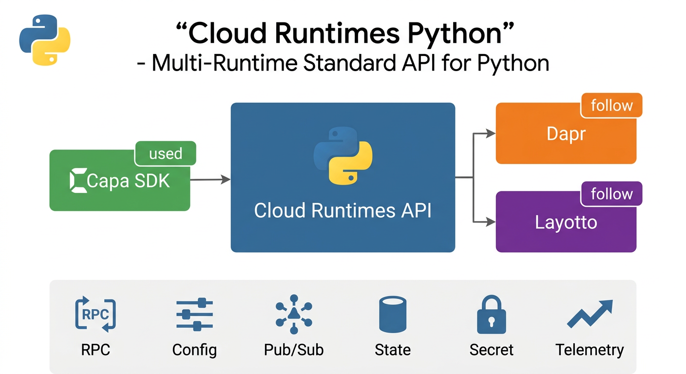
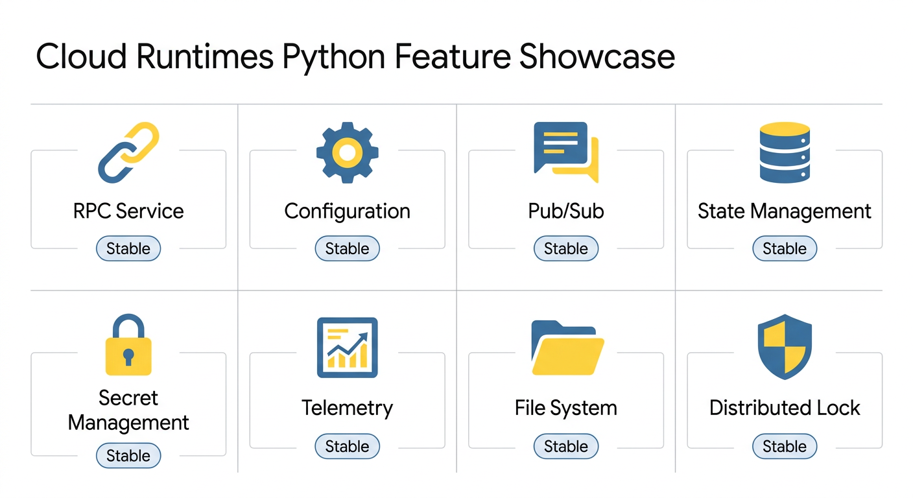

<p align="center">
  
</p>

<h1 align="center">Cloud Runtimes Python</h1>

<p align="center">
  <strong>Multi-Runtime Standard API for Python</strong>
</p>

<p align="center">
  <a href="https://github.com/capa-cloud/capa">Capa</a> ·
  <a href="https://dapr.io/">Dapr</a> ·
  <a href="https://github.com/mosn/layotto">Layotto</a>
</p>

<p align="center">
  
  
  
</p>

---

## 📖 Introduction

**Cloud Runtimes Python** provides the **Multi-Runtime Standard API** for Mecha architecture projects in Python.

This project defines a unified, vendor-neutral API specification that enables Python applications to use standardized interfaces for distributed system capabilities across different runtime implementations.

### Supported Runtimes

| Runtime | Status | Description |
|---------|--------|-------------|
| [Capa](https://github.com/capa-cloud/capa) | ✅ Used | Primary Mecha SDK implementation |
| [Dapr](https://dapr.io/) | 📋 Follow | Sidecar runtime reference |
| [Layotto](https://github.com/mosn/layotto) | 📋 Follow | MOSN-based sidecar implementation |

---

## 🏗️ Architecture

<p align="center">
  
</p>

### Module Structure

```
cloud-runtimes-python/
├── cloud_runtimes/         # Core API package
│   ├── rpc/                # RPC service invocation
│   ├── configuration/      # Configuration management
│   ├── pubsub/             # Pub/Sub messaging
│   ├── state/              # State management
│   ├── secret/             # Secret management
│   └── telemetry/          # Telemetry (logs, metrics, traces)
├── tests/                  # Test suite
├── docs/                   # Documentation
├── setup.py                # Package setup
├── pyproject.toml          # Modern Python packaging
└── requirements.txt        # Dependencies
```

**Key Design Principles:**
- **API-First**: Clean interfaces separate specification from implementation
- **Runtime Agnostic**: Works with Capa SDK, Dapr, Layotto, and future runtimes
- **Pythonic**: Follows Python best practices (PEP 8, type hints, async/await)
- **Vendor Neutral**: No lock-in to specific cloud providers

---

## ✨ Features

<p align="center">
  
</p>

### Stable Features

| Feature | Interface | Description | Status |
|---------|-----------|-------------|--------|
| 🔗 **Service Invocation** | `InvocationRuntimes` | Service-to-service communication | ✅ Stable |
| ⚙️ **Configuration** | `ConfigurationRuntimes` | Dynamic configuration management | ✅ Stable |
| 📨 **Pub/Sub** | `PubSubRuntimes` | Publish/Subscribe messaging | ✅ Stable |
| 💾 **State Management** | `StateRuntimes` | Key-value state storage | ✅ Stable |
| 🔐 **Secret Management** | `SecretsRuntimes` | Secure secret retrieval | ✅ Stable |
| 📊 **Telemetry** | `TelemetryRuntimes` | Logs, metrics, and traces | ✅ Stable |
| 📁 **File System** | `FileRuntimes` | File storage operations | ✅ Stable |
| 🔒 **Distributed Lock** | `LockRuntimes` | Distributed locking | ✅ Stable |

### Alpha Features

| Feature | Interface | Description | Status |
|---------|-----------|-------------|--------|
| 🗄️ **Database** | `DatabaseRuntimes` | SQL database operations | 🔬 Alpha |

---

## 🎯 Motivation

Cloud Runtimes Python was created to bring standardized, portable APIs to the Python ecosystem:

- **[Future plans for Dapr API](https://github.com/dapr/dapr/issues/2817)** - Community discussion on API standardization
- **[Make SDK independent](https://github.com/mosn/layotto/issues/188)** - Decoupling API from implementation
- **[Decompose core and enhanced APIs](https://github.com/dapr/dapr/issues/3600)** - API layering strategy

---

## 🚀 Getting Started

### Installation

#### From PyPI

```bash
pip install cloud-runtimes-python==0.0.1
```

#### In a Virtual Environment (Recommended)

```bash
python -m venv venv
source venv/bin/activate  # On Windows: venv\Scripts\activate
pip install cloud-runtimes-python==0.0.1
```

### Quick Example

```python
from cloud_runtimes.core import InvocationRuntimes

async def invoke(runtime: InvocationRuntimes) -> bytes:
    return await runtime.invoke_method(
        app_id="service-name",
        method_name="my-method",
        data=b'{"key":"value"}',
    )
```

### Runtime Implementations

This package defines abstract interfaces. Applications must provide an adapter
for their chosen runtime and inject those implementations into their own client
or service layer.

---

## 📚 API Interfaces

### Service Invocation

[`InvocationRuntimes`](cloud_runtimes/core/invocation.py) defines asynchronous
method invocation and registration, plus synchronous invocation helpers.

### Configuration

[`ConfigurationRuntimes`](cloud_runtimes/core/configuration.py) defines get,
save, delete, subscribe, and unsubscribe operations for configuration stores.

### State Management

[`StateRuntimes`](cloud_runtimes/core/state.py) defines single and bulk state
operations, optimistic-concurrency options, and transactional operations.

---

## 🌐 Ecosystem

Cloud Runtimes Python is part of the broader Capa Cloud ecosystem:

| Project | Language | Description |
|---------|----------|-------------|
| [cloud-runtimes-jvm](https://github.com/capa-cloud/cloud-runtimes-jvm) | Java | JVM API specification |
| [cloud-runtimes-golang](https://github.com/capa-cloud/cloud-runtimes-golang) | Go | Go API specification |

---

## 🤝 Contributing

We welcome contributions from the Python community!

1. Fork the repository
2. Create your feature branch (`git checkout -b feature/amazing-feature`)
3. Commit your changes (`git commit -m 'Add amazing feature'`)
4. Push to the branch (`git push origin feature/amazing-feature`)
5. Open a Pull Request

### Development Setup

```bash
# Clone the repository
git clone https://github.com/capa-cloud/cloud-runtimes-python.git
cd cloud-runtimes-python

# Create virtual environment
python -m venv venv
source venv/bin/activate  # On Windows: venv\Scripts\activate

# Install in development mode
pip install -e ".[dev]"

# Run tests
pytest tests/

# Run code quality checks
black .
isort .
flake8
```

### Code Style

We use industry-standard tools for code quality:

- **[Black](https://black.readthedocs.io/)** - Code formatting
- **[isort](https://pycqa.github.io/isort/)** - Import sorting
- **[flake8](https://flake8.pycqa.org/)** - Linting
- **[mypy](https://mypy.readthedocs.io/)** - Type checking

---

## 📜 License

This project is licensed under the Apache License 2.0 - see the [LICENSE](LICENSE) file for details.

---

<p align="center">
  <strong>Building portable, vendor-neutral cloud APIs for Python</strong>
</p>

<p align="center">
  <a href="https://github.com/capa-cloud">Capa Cloud</a> ·
  <a href="https://capa.rxcloud.group/">Documentation</a>
</p>
