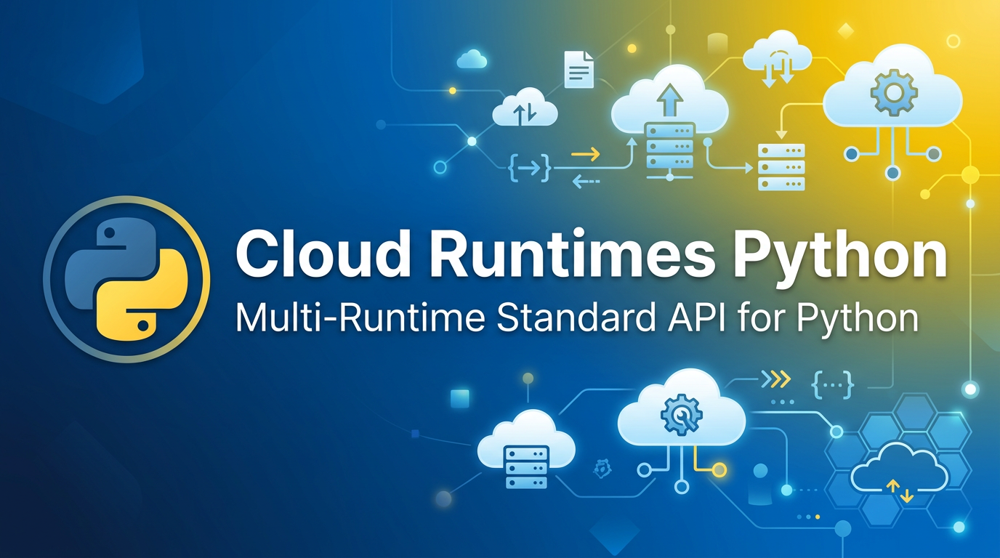

<p align="center">
  
</p>

# Cloud Runtimes Python

Compatibility-sensitive Python interfaces for multi-runtime application capabilities. This repository defines abstract APIs and shared request/response types; it does not bundle a Capa, Dapr, Layotto, or cloud-provider runtime implementation.

[Capa Cloud](https://github.com/capa-cloud) · [Documentation](https://capa.rxcloud.group/) · [Issues](https://github.com/capa-cloud/cloud-runtimes-python/issues)

> **Alpha status:** interface names and signatures are still evolving. Validate compatibility before implementing or upgrading an adapter.

## Installation

The PyPI `0.0.1` release predates the current `cloud_runtimes` package layout and is not compatible with the examples below. Until a corrected release is published, install the current source explicitly:

```bash
git clone https://github.com/capa-cloud/cloud-runtimes-python.git
cd cloud-runtimes-python
python -m venv .venv
source .venv/bin/activate  # Windows: .venv\Scripts\activate
python -m pip install -e .
```

Verify the package layout:

```bash
python -c "from cloud_runtimes.core import InvocationRuntimes; print(InvocationRuntimes.__name__)"
```

Do not use `pip install cloud-runtimes-python==0.0.1` for the current API.

## API groups

| Package | Interfaces |
| --- | --- |
| `cloud_runtimes.core` | Invocation, configuration, pub/sub, state, secrets, bindings |
| `cloud_runtimes.enhanced` | Database, file, distributed lock, telemetry |
| `cloud_runtimes.native` | Redis, SQL, S3-shaped native APIs |
| `cloud_runtimes.saas` | Email, SMS, encryption |
| `cloud_runtimes.types` | Shared request, response, option, and metadata types |

These entries describe interfaces defined by this package, not supported services in a deployed runtime.

## Implement an adapter

Runtime adapters subclass the interfaces they support. Applications should depend on those interfaces and inject a concrete implementation:

```python
from cloud_runtimes.core import InvocationRuntimes


async def invoke(runtime: InvocationRuntimes) -> bytes:
    return await runtime.invoke_method(
        app_id="service-name",
        method_name="my-method",
        data=b'{"key":"value"}',
    )
```

An adapter does not have to implement every API group, but it must clearly document unsupported operations and compatibility with this repository version.

## Repository layout

```text
.
├── cloud_runtimes/        # Current API package
│   ├── core/
│   ├── enhanced/
│   ├── native/
│   ├── saas/
│   └── types/
├── api/                   # Legacy pre-cloud_runtimes package sources
├── tests/
├── pyproject.toml
└── setup.py
```

New code should import `cloud_runtimes`, not the legacy top-level `api` package.

## Develop and verify

```bash
git clone https://github.com/capa-cloud/cloud-runtimes-python.git
cd cloud-runtimes-python
python -m venv .venv
source .venv/bin/activate
python -m pip install -e '.[dev]'
python -m pytest -q
python -m mypy cloud_runtimes
black --check cloud_runtimes tests
isort --check-only cloud_runtimes tests
flake8 cloud_runtimes tests
```

CI currently verifies tests on Python 3.8 and 3.11 and runs mypy on Python 3.11.

When changing an interface:

1. Keep request and response types explicit.
2. Update affected abstract methods and tests together.
3. Document compatibility impact for existing adapter implementations.
4. Do not include runtime credentials, private endpoints, or customer data in fixtures.

## Related projects

- [cloud-runtimes-jvm](https://github.com/capa-cloud/cloud-runtimes-jvm)
- [cloud-runtimes-golang](https://github.com/capa-cloud/cloud-runtimes-golang)
- [capa](https://github.com/capa-cloud/capa)

## License

Apache License 2.0. See [LICENSE](LICENSE).
